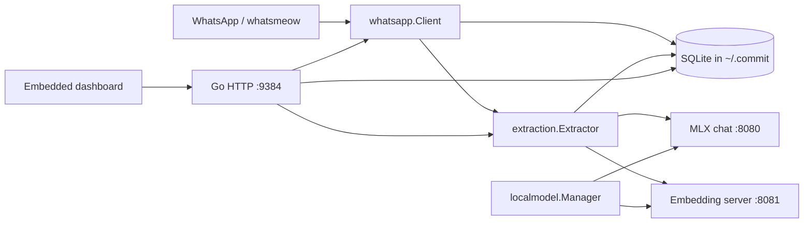

# Commit Codebase Wiki

> Fast orientation for coding agents and maintainers. This document describes the
> repository at version 1.3.2. Treat code as authoritative when it conflicts with
> this file, and update this file when architecture, routes, storage, models, or
> release procedures change.

## Product in one paragraph

Commit is a local-first WhatsApp commitment tracker. It links to WhatsApp through
the multi-device protocol, stores messages locally, sends message batches to a
local OpenAI-compatible MLX model, and records promises as commitments. A local
web dashboard supports review, replies, reminders, follow-ups, favorites, search,
and resolution. EmbeddingGemma provides local semantic search. There is no
application framework: the backend is Go, the database is SQLite, and the
frontend is one embedded HTML/CSS/JavaScript file.

## Start here

For most changes, read only the relevant entry points:

| Concern | Primary files |
|---|---|
| Process startup and dependency wiring | `main.go` |
| HTTP routes, handlers, auth | `server/server.go` |
| Dashboard UI | `server/static/index.html` |
| Database schema, settings, encryption | `store/db.go` |
| Commitment queries and lifecycle | `store/commitments.go`, `store/today.go` |
| WhatsApp connection and event ingestion | `whatsapp/client.go` |
| WhatsApp bot commands | `whatsapp/bot.go` |
| Extraction and auto-resolution | `extraction/commitments.go` |
| Search and embeddings | `extraction/find.go`, `extraction/semantic_index.go` |
| Local model installation/processes | `localmodel/manager.go` |
| macOS menu bar | `menubar/menubar_darwin.go` |
| Packaging | `scripts/build-mac.sh`, `scripts/build-windows.sh` |

Do not assume the README's architecture summary captures implementation details.
This file is the detailed map; tests and source remain the final authority.

## Repository map

```text
.
|-- main.go                       process entry point and wiring
|-- extraction/
|   |-- claude.go                OpenAI-compatible chat/embedding clients
|   |-- commitments.go           extraction, resolution, staleness loops
|   |-- find.go                  hybrid search and answer generation
|   `-- semantic_index.go        message/media embedding pipeline
|-- localmodel/
|   `-- manager.go               runtime repair, downloads, model subprocesses
|-- menubar/
|   |-- menubar_darwin.go        macOS systray UI
|   `-- menubar_stub.go          non-macOS implementation
|-- server/
|   |-- server.go                HTTP server, middleware, all API handlers
|   |-- nudge.go                 generated follow-up messages
|   |-- today.go                 Today endpoint assembly
|   `-- static/index.html        entire dashboard SPA, embedded by Go
|-- store/
|   |-- db.go                    SQLite open/migrations/settings/crypto
|   |-- messages.go              message persistence and retrieval
|   |-- commitments.go           commitment CRUD, views, stats, reminders
|   |-- today.go                 Today ranking algorithm
|   |-- semantic_index.go        vector persistence and cosine search
|   |-- media_assets.go          downloaded media metadata
|   `-- sessions.go              persistent web sessions
|-- whatsapp/
|   |-- client.go                whatsmeow client, events, sync, send operations
|   `-- bot.go                   commands sent through WhatsApp
|-- scripts/
|   |-- embedding_server.py      OpenAI-compatible EmbeddingGemma HTTP service
|   |-- start-mlx-gemma.sh       manual local-model startup/debug script
|   `-- build-*.sh               release packaging
|-- assets/, config/             app icons, signing entitlements
|-- docs/                        GitHub Pages release/update metadata
`-- landing/                     standalone marketing pages
```

## Runtime architecture



### Startup sequence

`main.go` performs the following:

1. Creates `~/.commit` with mode `0700`; it migrates legacy `~/.owe` if needed.
2. Appends logs to `~/.commit/commit.log`, rotating above 5 MiB.
3. Opens `~/.commit/commit.db` in WAL mode with a 5-second busy timeout.
4. Starts `localmodel.Manager`.
5. Creates the extractor, WhatsApp client, and HTTP server, then wires their
   callback interfaces.
6. In `sweep` CLI mode, runs staleness and resolution once, then exits.
7. Otherwise reconnects WhatsApp when configuration and a session exist.
8. Attempts to add `127.0.0.1 commit` to `/etc/hosts` on macOS/Linux.
9. Listens on `0.0.0.0:9384`, opens the dashboard, and starts the macOS menu bar
   when supported.

Shutdown is driven by a shared context on SIGINT/SIGTERM. The HTTP server gets a
5-second graceful-shutdown window.

### Background work

- WhatsApp events save incoming/history messages and media into SQLite.
- The extraction loop processes unprocessed messages in chat-grouped batches.
- Extraction asks the local model for structured JSON commitments and saves
  them idempotently.
- Resolution sweeps compare recent conversation against open commitments.
- Staleness checks close or update expired/transient records.
- Semantic indexing embeds unindexed messages in batches of 32.
- Media indexing describes images through the multimodal generation model, then
  embeds the description.
- Reminder and WhatsApp reconnect loops are owned by `whatsapp.Client`.

Read loop timing and batch limits directly from `extraction/commitments.go` and
`whatsapp/client.go` before changing throughput behavior.

## Core domain

### Message

`store.Message` is the normalized WhatsApp record. Important fields are message
ID, chat/sender JIDs and names, content, timestamp, ownership (`IsFromMe`), group
status, and extraction status (`Processed`).

Messages are the source material for extraction and search. Marking a message
processed prevents normal re-extraction; backfill/debug operations can requeue
messages.

### Commitment

`store.Commitment` represents one promise or obligation:

- `direction`: `you_owe` or `they_owe`
- `status`: `open`, `resolved`, `dismissed`, or `snoozed`
- `significance`: model-assigned importance, default `medium`
- source identity: quote, source time, message ID, chat and person
- lifecycle metadata: creation/resolution, `resolved_by`, nudge/reminder state
- presentation state: favorite and snooze flags

IDs are deterministic hashes generated by `GenerateCommitmentID`, which reduces
duplicates across repeated extraction. Keep direction/status strings aligned
with the SQLite `CHECK` constraints.

### Today and follow-ups

`store.GetTodayCandidates` builds candidates and `store.RankToday` scores,
deduplicates, and caps the Today list. Deadline language, age, direction,
significance, favorites, and recent activity affect ranking. Follow-ups are a
separate commitment query focused on stale obligations from other people.

### Search

`Extractor.Find` is hybrid:

1. Extract and expand keywords.
2. Resolve likely person names to chat JIDs.
3. Search person/topic matches, then global AND and OR matches.
4. Add best-effort semantic matches from EmbeddingGemma.
5. Pull surrounding messages for the strongest results.
6. Search and rank commitments.
7. Ask the generation model to synthesize a sourced answer.

Semantic vectors are JSON-encoded float arrays in SQLite and compared in Go
with cosine similarity. This is intentionally local and simple, not a vector
database.

## Persistence and security

The application data directory is `~/.commit/`:

| Path | Purpose |
|---|---|
| `commit.db` | Application SQLite database |
| `commit.db-wal`, `commit.db-shm` | SQLite WAL files |
| `whatsmeow.db` | WhatsApp linked-device state |
| `media/` | Downloaded WhatsApp media |
| `commit.log` | Application log |
| `.crypto_key` | Cached derived encryption key, mode `0600` |

### Tables

Schema version is currently **9**, managed manually in `store/db.go`.

- `settings`: key/value configuration and schema version
- `messages`: normalized WhatsApp message history
- `commitments`: extracted obligations and lifecycle state
- `favorite_chats`: pinned chats
- `muted_chats`: chats excluded from relevant surfaces
- `semantic_index`: source text plus embedding model/vector
- `media_assets`: local media files and generated descriptions
- `sessions`: hashes of persistent web-session tokens

When changing schema:

1. Add a version-gated migration in `DB.migrate`.
2. Make fresh-database `CREATE TABLE` definitions match the final schema.
3. Increment `setSchemaVersion`.
4. Make migrations tolerant of databases produced by earlier forks. Existing
   migrations intentionally include compatibility duplication.
5. Add/update store tests when behavior changes.

### Authentication and encryption

- Passcodes are hashed with bcrypt.
- Sensitive setting values use AES-GCM.
- A passcode-derived key uses PBKDF2-SHA256 and a stored salt.
- A machine-key fallback supports installations before passcode setup.
- The derived key is cached in `.crypto_key` so encrypted settings remain
  readable after a restart with a persistent browser session.
- Only SHA-256 hashes of web-session tokens are stored.
- Protected handlers use `requireAuth`; mutating public auth handlers also use
  `requireJSON`.

Do not expose the server outside a trusted LAN without revisiting TLS, CSRF,
cookie policy, rate limiting, and the intentionally local threat model.

## HTTP API

All routes are registered in `server.registerRoutes`. Static dashboard files are
served at `/`. Check individual handlers for methods and request/response shapes.

### Public routes

| Route | Purpose |
|---|---|
| `/api/qr` | QR representation |
| `/api/version` | App/update version data |
| `/api/status` | Setup and connection state |
| `/api/auth/check` | Current authentication state |
| `/api/auth/login` | Passcode login |
| `/api/auth/setup` | Initial passcode setup |

### Protected route groups

| Group | Routes and purpose |
|---|---|
| Setup/session | `/api/setup`, `/api/login`, `/api/login/qr`, `/api/logout` |
| Commitments | `/api/commitments`, `/grouped`, `/search`, `/stats`, `/detailed-stats`, `/update`, `/favorite`, `/reply`, `/context`, `/stale`, `/auto-resolved`, `/remind`, `/snooze` |
| Focus views | `/api/today`, `/api/followups`, `/api/followups/nudge`, `/api/favorites`, `/api/favorites/chat` |
| Chats/contacts | `/api/chats/mute`, `/api/chats/muted`, `/api/contacts` |
| Models/settings | `/api/model`, `/api/local-model/status`, `/api/my-style`, `/api/user-name`, `/api/setup/validate`, `/api/setup/update-key` |
| Search/admin | `/api/find`, `/api/backfill`, `/api/debug`, `/api/resolution-sweep`, `/api/local-ip` |

`/api/resolution-sweep` is registered without `requireAuth`; verify whether this
is intentional before extending similar administrative endpoints.

The server sets `nosniff`, frame denial, and a restrictive CSP. Any new external
frontend resource or endpoint may require a CSP update.

## Frontend

`server/static/index.html` is the complete production SPA and is embedded at
compile time with `//go:embed`. It contains markup, styles, state, API calls,
rendering, setup flow, dashboard views, modals, responsive behavior, and theme
logic.

Practical rules:

- Edit the embedded file, not `docs/index.html` or `landing/index.html`, for app
  UI changes.
- There is no bundler, package manager, component framework, or generated asset
  step.
- Search existing `fetch('/api/...')` calls before changing a handler contract.
- Keep every API error path usable; the helper named `api` centralizes much of
  the browser-side request handling.
- Test narrow/mobile and desktop layouts because all presentation logic shares
  one file.
- Restart/rebuild Go after editing the embedded HTML; a running binary does not
  observe file changes.

`docs/` is release/update web content. `landing/` is marketing content. Neither
is the in-app dashboard.

## WhatsApp integration

`whatsapp.Client` wraps `go.mau.fi/whatsmeow` and owns:

- linked-device persistence
- QR login and reconnect with exponential backoff
- live message and history-sync event handling
- contact/chat naming and JID normalization
- media download/persistence
- outbound dashboard replies and self-chat reminders
- background processing loops

JID handling is subtle. WhatsApp may identify the owner by phone-number JID or
LID. Use existing helpers such as `isSelfChat`, `sameUserJID`,
`normalizeUserJID`, and `PhoneForLID`; do not compare raw JID strings casually.
The focused tests in `whatsapp/client_test.go` protect these cases.

### Bot commands

- `commitments` or `c`: list open commitments
- `owe @person`: filter obligations by person
- `done <text>`: resolve a matching commitment
- `search <query>`: keyword commitment search
- `help` or `h`: command help
- `@find <question>`: hybrid message/commitment search through the local model
- `@commit [query]`: open-commitment context for the current chat

Most commands are self-chat only. `@commit` can work in any chat, and bot reply
target selection carefully handles phone and LID identities.

## Local models

Default endpoints:

- Chat completions: `http://127.0.0.1:8080/v1`
- Embeddings: `http://127.0.0.1:8081/v1`

Default models:

- Generation: `mlx-community/gemma-4-12B-it-qat-4bit`
- MTP draft: `mlx-community/gemma-4-12B-it-qat-assistant-nvfp4`
- Embeddings: `mlx-community/embeddinggemma-300m-4bit`

Alternative generation options are Qwen3-VL 2B and SmolVLM 256M. Gemma 4 E2B
and E4B identifiers exist for compatibility but normalize to the working 12B
path because current MLX loading is incompatible.

`localmodel.Manager` repairs dependencies through `pipx`, locates or installs
Hugging Face tooling and `mlx-vlm`, downloads model repositories into the
standard Hugging Face cache, starts both services, tracks status/output, checks
health, supports model switching, and stops stale listeners on its ports.

Environment overrides:

| Variable | Meaning |
|---|---|
| `COMMIT_LLM_BASE_URL` | Chat API base URL |
| `COMMIT_EMBEDDING_BASE_URL` | Embedding API base URL |
| `COMMIT_LLM_MODEL` | Fixed generation model; disables UI switching |
| `COMMIT_LLM_DRAFT_MODEL` | Draft model or `none` |
| `COMMIT_LLM_DRAFT_KIND` | Defaults to `mtp` |
| `COMMIT_LLM_NUM_DRAFT_TOKENS` | Speculative decoding token count |
| `COMMIT_EMBEDDING_MODEL` | Embedding model |
| `COMMIT_LLM_API_KEY` | Optional bearer token for compatible endpoints |

The oddly named `extraction/claude.go` no longer means Anthropic; it is the local
OpenAI-compatible transport layer.

## Build, run, and test

The module path is `github.com/msfoundry/commit`. `go.mod` currently declares Go
1.26.3. The README's older "Go 1.22+" statement may not be sufficient for the
current module, so follow `go.mod`.

```bash
# Run
go run .

# One-shot staleness/resolution processing
go run . sweep

# Build
go build -o commit .

# All tests
go test ./...

# Useful focused tests
go test ./store
go test ./extraction
go test ./whatsapp
```

Main direct dependencies:

- `whatsmeow`: WhatsApp multi-device client
- `modernc.org/sqlite`: pure-Go SQLite driver
- `getlantern/systray`: macOS menu bar
- `go-qrcode`: setup/login QR rendering
- `x/crypto`: bcrypt and PBKDF2

### Releases

Current app/release version appears in multiple places:

- `server.AppVersion`
- `scripts/build-mac.sh`
- `scripts/build-windows.sh`
- `docs/version.json`
- release filenames and possibly README/download pages

Search for the old version globally before cutting a release.

```bash
# macOS universal DMG, ad-hoc signed
./scripts/build-mac.sh

# macOS distribution build
DEVELOPER_ID="Developer ID Application: ..." \
NOTARY_PROFILE="commit-notary" \
./scripts/build-mac.sh

# Windows amd64 zip
./scripts/build-windows.sh

# Both
./scripts/build-all.sh
```

The macOS script builds arm64 and amd64 binaries, combines them with `lipo`,
creates an app bundle, signs it, optionally notarizes it, and builds a DMG.
Windows uses `CGO_ENABLED=0`. Release scripts write artifacts in the repository
root; avoid committing generated packages unintentionally.

## Change recipes

### Add or modify an API feature

1. Add store operations first if persistence is involved.
2. Add the handler and register it in `server.registerRoutes`.
3. Apply `requireAuth` and `requireJSON` consistently.
4. Update calls/rendering in `server/static/index.html`.
5. Test handler edge cases and run `go test ./...`.
6. Update this API map when a route is added or removed.

### Change commitment extraction

1. Read `buildExtractionPrompt`, extraction JSON structs, and `ProcessBatch`.
2. Preserve deterministic IDs and accepted enum values.
3. Consider how malformed model output is handled by `extractJSON`.
4. Check resolution behavior so extraction and closure remain consistent.
5. Extend `extraction/commitments_test.go`.

### Change WhatsApp ingestion

1. Trace the relevant event in `handleEvent`.
2. Preserve live-message/history-sync normalization parity.
3. Handle phone JIDs, LIDs, self-chat, groups, and outbound messages.
4. Avoid blocking the whatsmeow event callback with model/network work.
5. Extend `whatsapp/client_test.go`.

### Change models

1. Update model constants and normalization in `store/db.go`.
2. Update options, sizes, draft selection, startup, and health checks in
   `localmodel/manager.go`.
3. Update `scripts/start-mlx-gemma.sh` and README defaults.
4. Verify both chat and embedding endpoints independently.

### Change database schema

Follow the migration checklist under Persistence and test both a fresh database
and an upgrade from the previous schema version.

## Known sharp edges

- The dashboard is a large single HTML file. Search by API route or element ID
  and make narrow edits.
- SQLite migrations deliberately ignore some duplicate-column errors for
  compatibility. Do not "clean up" old migrations without testing real upgrade
  paths.
- The server binds all interfaces, despite being a local-first product.
- `/api/resolution-sweep` is public in route registration.
- API-key naming remains in places even though the normal backend is local.
- Model subprocess handling is macOS/Unix-oriented; Windows packaging expects
  externally available compatible endpoints.
- Embedding search is linear cosine comparison over JSON vectors and will scale
  with indexed row count.
- Updating a model ID affects cache lookup, process arguments, health checks,
  persisted settings, and semantic-index compatibility.
- Build artifacts can be large and may be tracked in this fork; inspect status
  before staging.
- `main.go` may prompt for administrator access to modify `/etc/hosts`.

## Validation checklist

For any meaningful change:

```bash
gofmt -w <changed-go-files>
go test ./...
go vet ./...
git diff --check
```

Also perform the relevant manual flow:

- setup/login and session persistence
- WhatsApp QR/reconnect and self-chat identity
- message ingestion and extraction
- dashboard desktop/mobile behavior
- local model download/start/status
- reminders, replies, and bot commands
- release build when touching packaging

## Keeping this wiki useful

Update `CODEBASE_WIKI.md` in the same change whenever you alter:

- package ownership or runtime wiring
- data paths or schema version
- API routes or authentication boundaries
- model defaults, endpoints, or process management
- bot commands
- build/release steps
- major known limitations

The goal is operational accuracy, not exhaustive API documentation. Prefer a
compact map with precise source pointers over duplicating implementation code.
